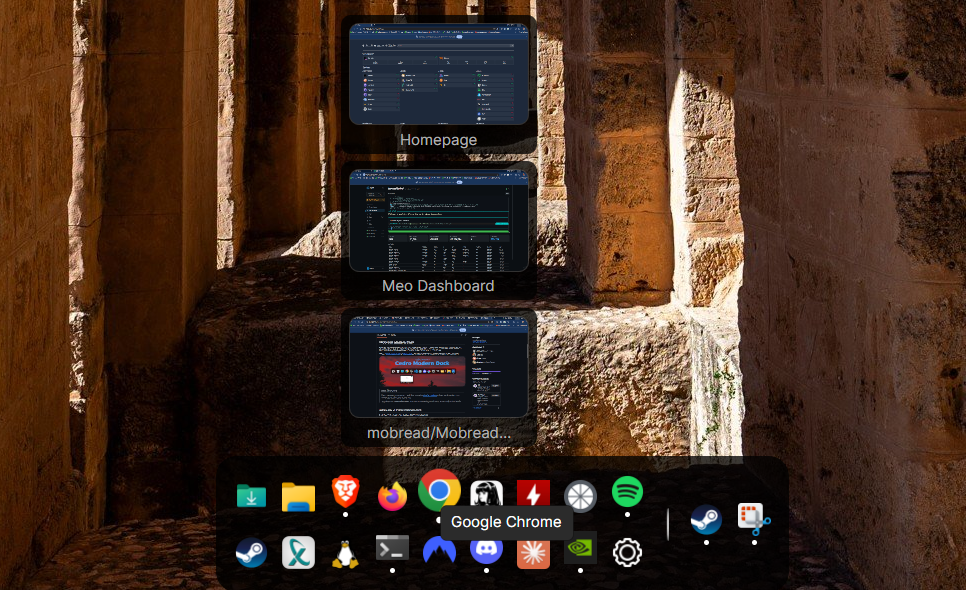

# Mobread Modern Dock

A macOS-style dock for Windows 11 that can **replace the taskbar** — pinned apps, running apps, folder stacks, live window previews, and a widget system that lives on the desktop layer or floats on top.

Built on [Cedro Modern Dock](https://github.com/Cedro-Software/cedro-modern-dock) by [@arthurdeka](https://github.com/arthurdeka). This project keeps that foundation and adds the features below.



<br>

> ## How To Install
> **Installer** — download **[MobreadModernDock-1.0.1-x64.msi](https://github.com/mobread/MobreadModernDock/releases/latest)** and run it. Adds Start-menu and desktop shortcuts, and uninstalls from Add/Remove Programs.
>
> **Portable** — download **[MobreadModernDock-1.0.1-x64-portable.zip](https://github.com/mobread/MobreadModernDock/releases/latest)**, unzip anywhere and run it. No install, no admin; settings live beside the exe, so the folder travels with you and deleting it leaves nothing behind.
>
> Either way: Windows 10/11 64-bit, no .NET install needed (the runtime is bundled).
>
> Neither download is code-signed, so SmartScreen will show *"Windows protected your PC"* — click **More info → Run anyway**. Verify a download if you prefer:
> ```powershell
> Get-FileHash MobreadModernDock-1.0.1-x64.msi -Algorithm SHA256
> # MSI  6AAEC5F37767592557EE1B21943145CCCA496E0CA722BFFB0DC679C2895FD8F3
> # ZIP  DCD90CF79E6D74603A2CB814671BD8F31810BEFC3C827C42941D78AD084A168D
> ```
> Prefer to build it yourself? See [How To Contribute](#how-to-contribute) below.
>
> On the very first launch the dock seeds itself from your Windows taskbar pins, so it is usable straight away. Upgrading from **Cedro Modern Dock**? Your shortcuts and settings are picked up automatically instead.

<br>

## What's new in Mobread Modern Dock

Everything in this section is new relative to Cedro Modern Dock v1.2.

### Replace the taskbar

- **Hide the Windows taskbar** — one checkbox hides the taskbar on every monitor and expands the work area so maximized windows use the full screen. Restored automatically when you uncheck it, quit, or if the app crashes; a taskbar left hidden by a force-kill is repaired on the next launch.
- **System tray widget** — your notification-area icons (Discord, Steam, NVIDIA, etc.) as a free-floating panel. Left-click activates, right-click opens the app's real context menu. Horizontal or vertical, wrapped into 1–6 rows or columns, with a toggle for the system icons (volume, network, battery).
- **Taskbar-style clicks** — click a running app to focus it, click again to minimize it, keep clicking to cycle through its windows. The mouse wheel over an icon cycles too.
- **Running apps you haven't pinned** appear on the dock; right-click to **pin** them, or **unpin** a pinned one.

### Widgets

Free-floating panels that follow the dock's colour and corner rounding. Each remembers its position and screen, has its own opacity (or follows the global slider), snaps to screen edges, and hides with the dock during fullscreen apps. Add as many as you like from **Settings › Widgets**.

| Widget | What it does |
|---|---|
| **Clock** | 10 layout presets — 12/24 h, seconds, weekday, short / long / ISO date — or any .NET format string, previewed live as you type. Optional second line for the date. |
| **Now Playing** | Whatever Windows is playing — Spotify, browser, VLC — with album art, title and artist, and previous / play-pause / next buttons. Same source as the volume flyout's media card. |
| **Weather** | Current conditions, today's high/low, humidity and wind, plus a 5-day strip. Type a city name to set the location; °C/°F toggle. Powered by Open-Meteo — no API key needed. |
| **Calendar** | Month grid with today highlighted. Flip months with ‹ ›, click the title to jump back. Optional ISO week numbers, and a first-day-of-week override. |
| **Quick Launch** | A second tier of shortcuts as a compact grid — programs, `.lnk` shortcuts or folders — with adjustable columns, icon size and optional labels. |
| **System monitor** | CPU, RAM, GPU and network as bars that shift green → amber → red with load. Toggle each metric, a compact bars-only mode, 0.5–5 s refresh. CPU matches Task Manager's number; the network bar auto-scales to your link speed. |
| **System tray** | See above. |
| **Text** | Any text, with `{host}` and `{user}` placeholders. |

### Dock layout & behaviour

- **Dock on every monitor** — one checkbox mirrors the dock onto each display. Mirrors follow the primary's items, look and position (relative to their own screen).
- **Appearance presets** — save the current look under a name and switch with one click. Four built-ins to start from (Classic dark, Glass, Compact, Midnight blue).
- **Attention bounce** — when an app flashes its taskbar button for attention, its dock icon hops until you click it or the app comes to the front.
- **Multi-row dock** — 1 to 4 rows (or columns when the dock is vertical).
- **Auto-hide** — the dock slides off the nearest screen edge after a short grace period, leaving a 3 px sliver; touch it with the pointer to bring it back. Won't hide while you're hovering a preview or dragging an icon.
- **Fullscreen auto-hide** — dock and widgets get out of the way while a fullscreen app is running. Borderless-window games count; a merely maximized window doesn't.
- **Edge snapping** — drop the dock or a widget within 24 px of a screen edge or the centre line and it snaps flush, each axis independently.
- **Always on top** — keep the dock and widgets over every window, or leave them on the desktop layer where they survive Win+D.
- **Drag to reorder** icons directly on the dock, with a drop indicator. Works across rows. The settings gear always stays last.

### Launching

- **Ready on first launch** — a fresh install seeds the dock with your Windows taskbar pins, a divider, This PC and the Recycle Bin, so it is usable before you open Settings. Nothing is imported on later launches; your config is yours.
- **Import Taskbar Pins** — one button in Settings pulls in everything pinned to your Windows taskbar (skipping anything already on the dock).
- **Folder stacks** — clicking a folder opens a macOS-style icon grid anchored to the dock instead of launching Explorer. Drill into subfolders in place; right-click reveals the item in Explorer.
- **`.lnk` shortcut support** — "Add Program" accepts shortcuts, including multi-select. Target, arguments, working directory and icon are read from the shortcut, and the two shortcut shapes that break most dock apps (MSI advertised shortcuts like WSL, shell-object shortcuts like File Explorer) are handled.
- **Live window previews** — hover a running app to see its open windows, click one to bring it forward. Positioned correctly on multi-monitor layouts.

### Appearance

- **Global opacity slider** (20–100 %) fades the entire dock — icons and background — and every widget that follows it. Independent of the existing background-only transparency.
- **Per-widget opacity** — follow global, or set a custom value per widget.
- **Resizable settings window** — 860×700 by default, drag to resize.

### Multi-monitor

The dock and widgets are placed with true screen coordinates, so they land on the right display even when the primary monitor isn't at the top-left of the layout. Positions no longer drift between launches on those setups.

### Under the hood

- **Portable mode** — drop a file named `portable.marker` next to `MobreadModernDock.exe` and all settings, icon cache and logs stay in that folder instead of `%APPDATA%`. Good for a USB stick or a synced folder.
- **Update check** — Settings › General › *Check for updates* looks at GitHub Releases and links the download.
- **Login-safe startup** — waits for the Windows shell to be ready before attaching to the desktop, so an auto-started dock never races Explorer.

<br>

## Also included (from Cedro Modern Dock)

Live window previews · running-app indicators · iOS-style icon tint with 12 presets or a custom colour · vertical dock · dock transparency and rounding · auto-start with Windows · 21 languages · in-place upgrades that keep your settings.

<br>

## How To Exit / Uninstall

**Exit** — right-click the settings gear on the dock and choose **Quit Mobread Dock**. That is the only exit path, and it restores the Windows taskbar if you had it hidden.

**Uninstall (installer)** — quit first, then remove *Mobread Modern Dock* from **Settings › Apps › Installed apps** (or Add/Remove Programs). Your settings stay in `%APPDATA%\MobreadModernDock`; delete that folder to remove them too.

**Uninstall (portable)** — quit, then delete the folder. Settings live beside the exe, so nothing is left behind.

> Force-killed the app with the taskbar hidden? The taskbar is restored automatically the next time the dock starts.

<br>

## Supported Languages

🇺🇸 English · 🇧🇷 Portuguese (Brazil) · 🇪🇸 Spanish · 🇫🇷 French · 🇩🇪 German · 🇯🇵 Japanese · 🇨🇳 Chinese (Simplified) · 🇹🇼 Chinese (Traditional) · 🇮🇳 Hindi · 🇸🇦 Arabic · 🇧🇩 Bengali · 🇷🇺 Russian · 🇵🇰 Urdu · 🇮🇩 Indonesian · 🇳🇬 Nigerian Pidgin · 🇮🇳 Marathi · 🇮🇳 Telugu · 🇹🇷 Turkish · 🇮🇳 Tamil · 🇭🇰 Cantonese · 🇻🇳 Vietnamese

<br>

<!-- SUPPORT -->
## Support This Project

If this dock earned a spot on your desktop, you can leave a tip — it's genuinely appreciated and helps keep the features coming.

[](https://ko-fi.com/mobreadmeo)

<br>

<!-- GETTING STARTED -->
## How To Contribute
> Only needed if you want to work on the code.

### Project architecture

The project follows a layered architecture:

- `MobreadModernDock.Core`: Domain models, application services, widget definitions, and i18n (portable, no OS deps)
- `MobreadModernDock.Infrastructure.Windows`: Windows-specific adapters (Win32 interop, UI Automation, icon extraction, performance counters, JSON persistence, registry auto-start)
- `MobreadModernDock`: Avalonia UI (dock view, settings window, widget providers, view models)
- `MobreadModernDock.Tests`: xUnit test suite

`App.axaml.cs` composes these dependencies and injects them into the view models. New widgets implement `IWidgetProvider` and register in `WidgetRegistry`.

For the implementation notes behind each feature — the Win11 tray XAML island, DWM capture limits, appbar re-creation, parent-relative coordinates on Progman — see [`CUSTOMIZATIONS.md`](CUSTOMIZATIONS.md).

### Prerequisites

- **.NET 9 SDK**
- **Git**
- An IDE (Visual Studio 2022 or Rider recommended) — optional

### Run locally

```bash
cd dotnet
dotnet restore
dotnet run --project src/MobreadModernDock
```

### Build a release `.exe`

```bash
cd dotnet
dotnet build src/MobreadModernDock -c Release
# → src/MobreadModernDock/bin/Release/net9.0-windows/MobreadModernDock.exe
```

### Run the tests

```bash
cd dotnet
dotnet test tests/MobreadModernDock.Tests -c Release
```

### Build the installer

Requires the [WiX Toolset **v6**](https://wixtoolset.org/) CLI — v7 requires a paid maintenance-fee EULA, so pin v6:

```powershell
dotnet tool install --global wix --version 6.0.2
wix extension add -g WixToolset.UI.wixext/6.0.2
wix extension add -g WixToolset.Util.wixext/6.0.2
cd dotnet\installer
.\build.ps1          # version comes from <Version> in MobreadModernDock.csproj
```

<br>

## License

GPL-3.0 — see [`LICENSE`](LICENSE). Original work © [Arthur Deka](https://github.com/arthurdeka) / Cedro Software; modifications © mobread.
